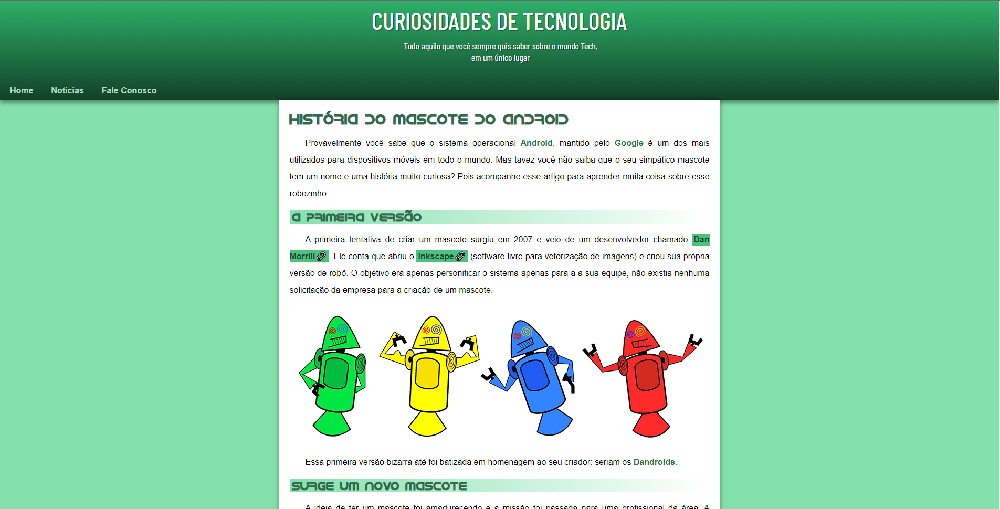

# Projeto: Site Android



## Descrição do Projeto
<p> Projeto Android criado no capitulo 17 do Curso de HTML e CSS do Curso em Vídeo. </p>

## 🚀 Tecnologias utilizadas
- ``HTML``
- ``CSS``

## :memo: Licença

Esse projeto está sob a licença MIT.

## 🔗 Link para o site

```
https://rubensgabriel.github.io/projeto-android/
```
